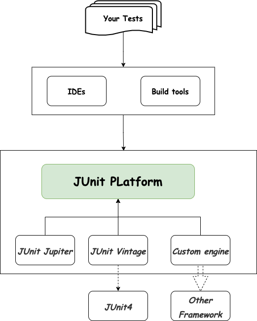

## 本章要点

1. JUnit 5 组成

## 学习目标

1. 熟练掌握 JUnit 5 是由几部分组成，每部分对应的作用

## 思考

::: tip Question
编写测试用例时，使用 JUnit 5 中的哪个部分提供注解和断言方法来定义测试用例？

使用 JUnit 5 中的哪个部分编写自定义的扩展，以满足项目特定的需求？
:::


## JUnit 5特点

1. `JUnit 5` 是面向 `Java 8` 及更高版本的开源测试框架，可以完全替换或兼容`JUnit 4`。
    >新的版本肯定要兼容旧的版本以及旧版本的技术，只是新版本增加了自己特有的一些特性，或者是有些使用方式上（比如：导包，对应包的位置及导入的包名方式有改变）有些改变。

2. `JUnit 5` 提供了丰富的功能——从改进的注解、标签和过滤器到条件判断执行和分组断言。
    >基于 TDD 编写单元测试变得轻而易举。

3. 新框架还带来了一个强大的扩展模型。开发人员可以使用这个新模型向 `JUnit 5` 中添加自定义功能。
    >这种自定义扩展机制为 Java 程序员提供了一种创建、执行（即 BDD 规范测试）的方法。
4. `JUnit 5` 在运行时需要 `Java 8` 或更高版本。本系列使用的是Java 11。


## JUnit 5组成

与以前的 `JUnit` 版本不同，`JUnit 5`由三个部分组成。

>JUnit 5 不是一个模块里面写完所有的功能及特性，在JUnit 5这个新一代的JUnit框架中，分了3个不同的子模块来进行框架的业务特性的区分。

1. 一个基础平台

2. 一个新的编程和扩展模型 `Jupiter`
3. 一个名为 `Vintage` 的向后兼容的测试引擎

```text
JUnit 5 =  JUnit Platform  +  JUnit Jupiter  +  JUnit Vintage
```

JUnit 5 不仅仅只是一个测试框架，它的重大改进不仅仅只是打破了常规的API，或者引入了新的扩展模型。还有一个非常重要的目标，就是打造一个基于JVM测试框架的基础平台。我们来看一个图：



可以看到，就像洋葱一样，JUnit 5 的架构也是分层的，最核心的就是基础平台 JUnit Platform。IDE和构建工具都是作为**客户端**和这个核心平台交互，以达到在项目中运行测试的目的。TestEngine的实现在平台中用于发现和运行测试、输出测试报告，通过核心平台返回给客户端。

JUnit 5 的核心关注点是扩展能力，但并不仅仅只是存在于测试类级别。在整个测试平台级别，都提供了足够的扩展能力。 **任何一个框架都可以在 JUnit 5 平台上运行他的测试用例，只需要提供框架本身对TestEngine接口的实现即可。** 只需要一点点工作，通过这一个扩展点，框架就能得到所有IDE和构建工具在测试上的支持。这对于新框架来说绝对是好事，在测试和构建这块的门槛更低。

这些对于一个开发者来说意味着什么呢？这意味着一个测试框架和JVM开发市场上所有主流的工具集成的时候，你能更容易的说服你的经理，开发leader，或者不管是谁阻碍你引入这个测试框架的人。 JUnit Vintage就是一个TestEngine实现，用于执行JUnit4的测试。

### Junit Platform

JUnit 5 的核心，它定义了一种测试平台，允许不同的测试引擎（Test Engines）来运行测试。JUnit 5 本身包含了一个默认的测试引擎，也可以与其他测试引擎一起使用。

### Junit Jupiter

JUnit 5 的测试 API，JUnit Jupiter 提供了一系列注解和断言方法，使得编写和执行测试变得更加灵活和强大。

### Junit Vintage

一个运行 `JUnit 3` 和 `JUnit 4` 测试和迁移支持到 `JUnit 5` (`JUnit Jupiter`) 的测试引擎。

>迁移现有项目到 JUnit 5 非常有用

- `JUnit 5 Jupiter` 的扩展模型可用于向 `JUnit` 中添加自定义功能。

- 扩展模型 `API` 测试生命周期提供了**钩子**和**注入自定义参数的方法**（即依赖注入）。

## 总结

- JUnit 5组成：`JUnit Platform`、`JUnit Jupiter`、`JUnit Vintage`。

- 测试用例编写用到的是`JUnit Jupiter`模块。

## 学习反馈

1. JUnit 5 的核心组件是什么？

   - [ ] A. JUnit Jupiter
   - [ ] B. JUnit Vintage
   - [ ] C. JUnit Platform
   - [ ] D. JUnit Neptune
   ::: details Answer
   答案：C
   :::

2. JUnit Jupiter 提供了什么功能？
   - [ ] A. 测试引擎
   - [ ] B. 断言方法
   - [ ] C. 注解
   - [ ] D. 所有上述选项
   ::: details Answer
   答案：D
   :::

3. 用于在JUnit 5中运行旧版本测试的是什么？
   - [ ] A. JUnit Jupiter
   - [ ] B. JUnit Vintage
   - [ ] C. JUnit Classic
   - [ ] D. JUnit Retro
   ::: details Answer
   答案：B
   :::

4. JUnit 5 的扩展性是通过哪个组件实现的？
   - [ ] A. JUnit Platform
   - [ ] B. JUnit Jupiter
   - [ ] C. JUnit Vintage
   - [ ] D. 扩展性不是JUnit 5 的一个特性
   ::: details Answer
   答案：A
   :::

5. 在JUnit 5中，如何组织测试用例以便更好地管理和执行它们？
   - [ ] A. 使用测试引擎
   - [ ] B. 使用测试标签
   - [ ] C. 使用测试接口
   - [ ] D. 所有上述选项
   ::: details Answer
   答案：D
   :::
