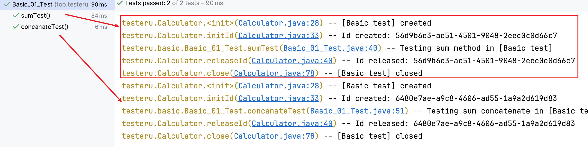

## 本章要点

1. 基本注解：@Test、@BeforeEach、@AfterEach、@BeforeAll、@AfterAll

## 学习目标

1. 熟练掌握使用基本注解便携测试用例

## 思考

::: tip Question
JUnit 5 有哪些基本的注解，用于标记测试方法和控制测试的行为？
:::

## @Test

@Test 注释用于标记单元测试方法。

JUnit 5 中，所有测试方法都必须使用 @Test 注释进行标记，否则它们不会被 JUnit 框架识别为测试方法。

@Test 注释的**参数**包括 `timeout` 和 `expected` 。

- timeout 用于设置测试方法的最大执行时间（单位为毫秒），如果测试方法的执行时间超过了该值，则测试将失败。

- expected 用于设置测试方法预期的异常类型。

## @BeforeEach

@BeforeEach 注释用于标记在每个测试方法之前要执行的方法。

@BeforeEach 注释的方法必须是公共的、没有参数的，并且没有返回值。

@BeforeEach 注释的方法将在每个测试方法执行之前被调用。

## @AfterEach

@AfterEach 注释用于标记在每个测试方法之后要执行的方法。

@AfterEach 注释的方法必须是公共的、没有参数的，并且没有返回值。

@AfterEach 注释的方法将在每个测试方法执行之后被调用。


## 注解示例

```java
package top.testeru.basic;

import org.junit.jupiter.api.AfterEach;
import org.junit.jupiter.api.Assertions;
import org.junit.jupiter.api.BeforeEach;
import org.junit.jupiter.api.Test;
import org.slf4j.Logger;
import top.testeru.Calculator;

import static java.lang.invoke.MethodHandles.lookup;
import static org.slf4j.LoggerFactory.getLogger;

/**
 * @program: junit5_tutorial
 * @author: 盖盖
 * @description: 基本注解
 * 执行顺序：
 *      @BeforeEach --> @Test修饰的方法1 --> @AfterEach -->
 *      @BeforeEach --> @Test修饰的方法2 --> @AfterEach
 * @Date: 2023/10/8
 */
public class Basic_01_Test {
    static final Logger log = getLogger(lookup().lookupClass());

    Calculator calculator;

    /**
     * @BeforeEach:void返回值
     *  执行顺序：在每一个@Test注解修饰的方法之前运行一次；当前测试类有多少个@Test注解，@BeforeEach注解修饰的方法就运行多少次
     *  应用场景：测试用例中，测试方法需要初始化的内容及属性，比如：app/web端进入固定页面，回退到固定页面；重启app；删除某些产生的测试数据
     */
    @BeforeEach
    void setup() {
        calculator = new Calculator("[Basic test]");
        calculator.initId();
    }

    @Test
    void sumTest() {
        log.debug("Testing sum method in {}", calculator.getName());

        // exercise 业务调用
        int sum = calculator.sum(1, 2, 3);

        // verify 断言
        Assertions.assertTrue(sum == 6);
    }

    @Test
    void concanateTest() {
        log.debug("Testing sum concatenate in {} SUT", calculator.getName());

        // exercise
        String phrase = calculator.concatenate("hello", "world");

        // verify
        Assertions.assertTrue(phrase.equals("hello world"));
    }

    /**
     * @AfterEach:void返回值
     *   执行顺序：在每一个@Test注解修饰的方法之后运行一次；前测试类有多少个@Test注解，@AfterEach注解修饰的方法就运行多少次
     *   应用场景：测试用例中，测试方法需要初始化的内容及属性，比如：app/web端进入固定页面，回退到固定页面；重启app；删除某些产生的测试数据
     */
    @AfterEach
    void teardown() {
        calculator.releaseId();
        calculator.close();
    }

}
```


