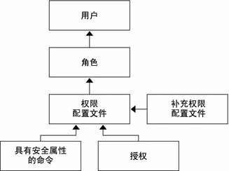
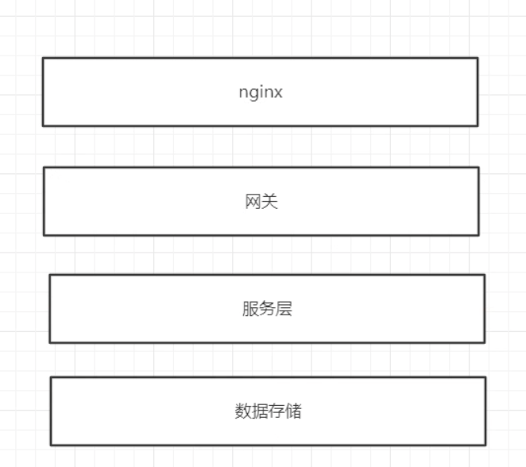
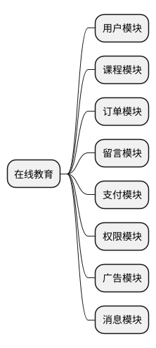
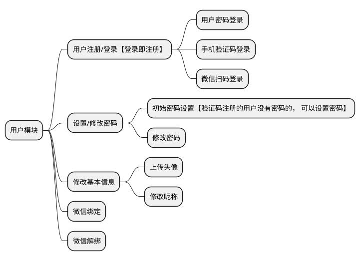
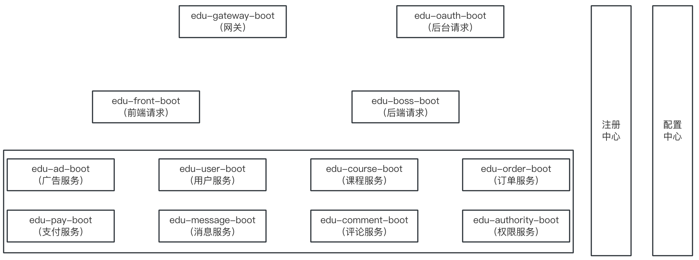
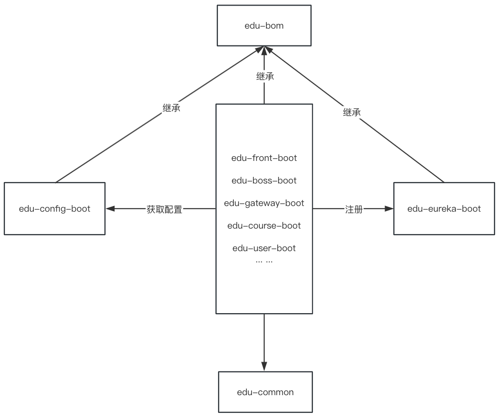
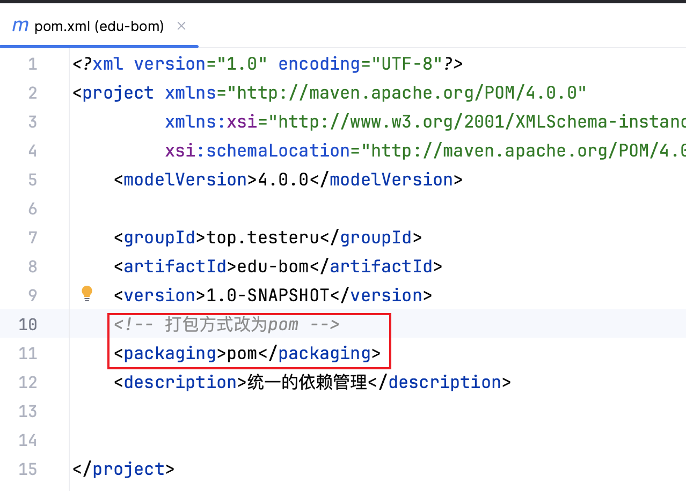

arcticons:projectm
## 本章要点

1. 权限管理系统-RBAC 概念
2. 

## 学习目标

1. 

## 思考

::: tip Question

:::

## RBAC



## 系统通用架构划分



## 在线教育模块划分



## 开发规约

### 服务命名

规律：edu-XXX(服务名称)-boot

::: warning 服务名

- [ ] `edu-message-boot`：留言模块

- [ ] `edu-comment-boot`：消息模块
- [ ] `edu-ad-boot`：广告模块
- [ ] `edu-user-boot`：用户模块
- [ ] `edu-order-boot`：订单模块
- [ ] `edu-authority-boot`：权限模块
- [ ] `edu-boss-boot`：课程模块
- [ ] `edu-pay-boot`：支付模块
- [ ] `edu-common`
:::

### URL 命名

**查询**: `http://xxx.edu.com/front/course/getlist` ---  get 开头

**保存**: `http://xxx.edu.com/front/course/saveXx`  ---  save 开头

**更新**: `http://xxx.edu.com/front/course/updateXx` ---  update 开头

### 接口响应格式

该接口规范适用于前端与后端交互，后端各个服务之间交互。

- `content`：用于封装业务数据

- `state` 响应码

- `message`：提示信息

::: info 响应模版

```json
{
    "content": "自定义业务数据",
    "state": 1,
    "message": "自定义消息，用于前端显示"
}
```

:::

### 接口文档

跟前端交互的接口文档建议选择 `swagger`。

#### 手写 Api 文档的几个痛点

1. 文档需要更新的时候，需要再次发送一份给前端，也就是文档更新交流不及时。
2. 接口返回结果不明确。不能直接在线测试接口，通常需要使用工具，比如 postman 接口文档太多，不好管理

#### 使用 swagger 的好处

Swagger 可以整合到代码中，在开发时通过注解，编写注释，自动生成将前端后台分开，不会有过分的依赖。

界面清晰，无论是 editor 的实时展示还是 ui 的展示都十分人性化，如果只用 markdown 来编写，又要纠结该如何展现，十分痛苦。

支持 Json 和 yaml 来编写 API 文档，并且支持导出为 json、yaml、markdown 等格式。

## 技术选型

框架&组件|版本|说明
|---|---|---|
Nginx|1.17.8|负载/转发
Spring Cloud|Greenwich.RELEASE|使用到的组件:<br>Eureka<br>Feign<br>Gateway<br>Hytrix<br>Ribbon<br>Config
RocketMQ|4.7.0|消息队列
Rabbitmq|3.8.5|消息队列
Sentinel|1.7.2|限流降级
Alibaba Cloud OSS|3.1.0|阿里云 OSS
XXL-job|2.2.0|分布式 job
MySQL|5.7.28|数据库
Redis|5.0.8|缓存
Sharding-jdbc|1.5.4|分库分表
Swagger|2.9.2|API 接口文档

ssh DSM/SRM luoluo@DSM/SRM IP 地址 -p SSH 端口号

## 功能模块

### 用户模块



#### 用户注册/登录

**功能描述**：用户输入手机号、密码，点击登录。调用后端接口开始登录，如果该手机号未注册则会注册并登录(手机号+密码情况下不注册)。

**需要校验必要数据**：

1. 手机号是否合法，如校验不通过提示：手机号不合法。 

2. 密码长度是否合法，如校验不通过提示：密码长度不合法。

登录成功后返回 `access_token`、`refresh_token`，其他接口每次请求都要携带 `access_token`。

**功能接口**：/front/user/login·

## 系统架构图






## 项目创建


注意：bom项目为所有依赖管理，打包方式改为pom


