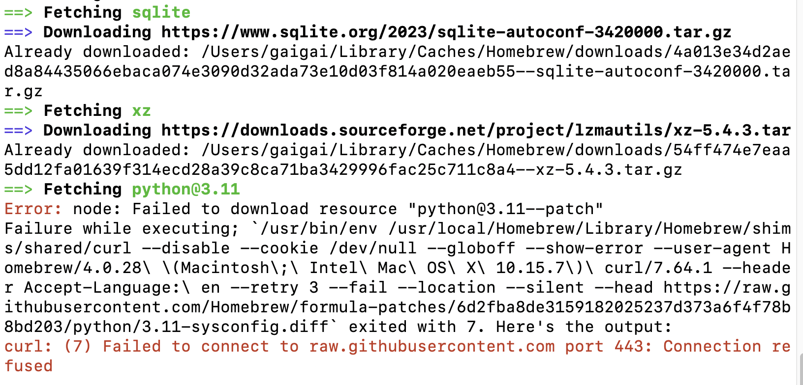

## 安装brew

前置：安装python。

```bash
/bin/bash -c "$(curl -fsSL https://gitee.com/ineo6/homebrew-install/raw/master/install.sh)"


brew update
```

#### 下载问题



1. 科学上网，命令行复制到终端进行，未解决。
2. 换brew源。


## 更换源

### 更换中科大源
```shell
# 替换brew.git:
cd "$(brew --repo)"
git remote set-url origin https://mirrors.aliyun.com/homebrew/brew.git

# 替换homebrew-core.git:
cd "$(brew --repo)"/Library/Taps/homebrew/homebrew-core
git remote set-url origin https://mirrors.aliyun.com/homebrew/homebrew-core.git

# 替换homebrew-cask.git:
cd "$(brew --repo)"/Library/Taps/homebrew/homebrew-cask
git remote set-url origin https://mirrors.ustc.edu.cn/homebrew-cask.git

# 替换homebrew-bottles:
echo 'export HOMEBREW_BOTTLE_DOMAIN=https://mirrors.ustc.edu.cn/homebrew-bottles' >> ~/.bash_profile

#更新配置
source ~/.bash_profile

#验证
brew update
```


## 重置官方源
```shell
#重置brew.git:
cd "$(brew --repo)"
git remote set-url origin https://github.com/Homebrew/brew.git

#重置homebrew-core.git:
cd "$(brew --repo)/Library/Taps/homebrew/homebrew-core"
git remote set-url origin https://github.com/Homebrew/homebrew-core.git

#重置homebrew-cask.git：
cd "$(brew --repo)"/Library/Taps/homebrew/homebrew-cask
git remote set-url origin https://github.com/Homebrew/homebrew-cask
#Caskroom 的 Git 地址在 2018年5月25 日从 https://github.com/caskroom/homebrew-cask 迁移到了 https://github.com/Homebrew/homebrew-cask 

#最后注释掉/.bash_profile里的homebrew-bottles并保存，以bash为例
cd ~
open .bash_profile

#更新.bash_profile
source .bash_profile
```


## node/npm

首先把brew安装成功，再使用brew安装node。

```bash
brew install node


node -v

npm -v
```

