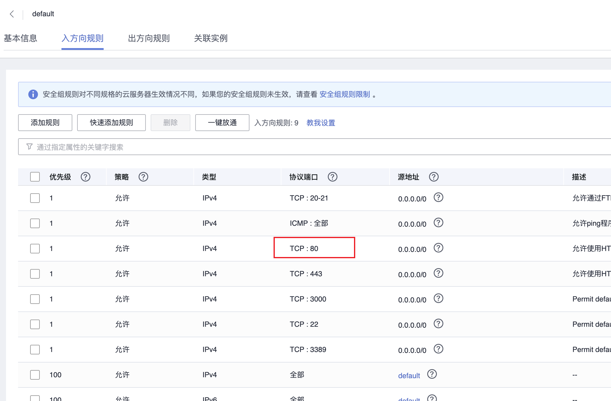
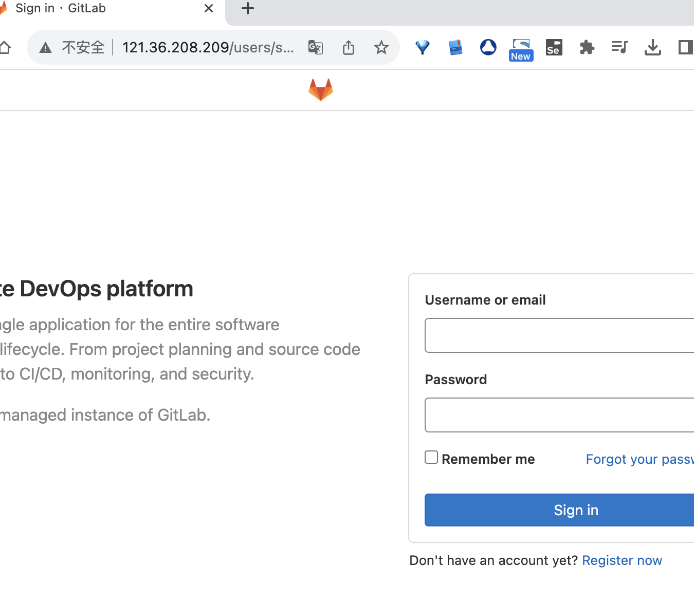

## 安装 GitLab
### 命令

```bash
## 通过运行以下命令确保所有系统包都是最新的 apt 终端中的命令。
sudo apt update
sudo apt upgrade
sudo apt install build-essential curl file git ca-certificates

## 将 GitLab 存储库添加到您的 Ubuntu 系统
curl -sS https://packages.gitlab.com/install/repositories/gitlab/gitlab-ce/script.deb.sh | sudo bash
## 使用以下命令下载 Gitlab 包
wget --content-disposition https://packages.gitlab.com/gitlab/gitlab-ce/packages/ubuntu/bionic/gitlab-ce_14.1.2-ce.0_amd64.deb/download.deb
## 使用以下命令安装下载的 .deb 包
dpkg -i gitlab-ce_14.1.2-ce.0_amd64.deb
## 运行以下命令启动 GitLab 实例
gitlab-ctl reconfigure
gitlab-ctl start
## 获取 GitLab 服务的状态
gitlab-ctl status
## 配置防火墙。Ubuntu 22.04 有 ufw 默认运行的防火墙。 通过端口 HTTP 和 HTTPS 启用连接：
sudo ufw allow https
sudo ufw allow http
sudo ufw allow ssh
sudo ufw enable
sudo ufw status
```

### 端口开放


云服务器入方向开通80端口

### 打开验证

浏览器打开：http://121.36.208.209/users/sign_in




### 配置GitLab域名，否则项目git clone的地址时错

```bash
vim  /etc/gitlab/gitlab.rb

```

1. 编辑：external_url '你的网址'

    >例如：external_url 'http://121.36.208.209/'

2. 编辑完成后，再sudo gitlab-ctl reconfigure一下，使配置生效
